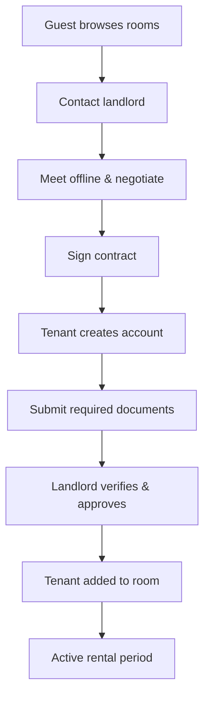
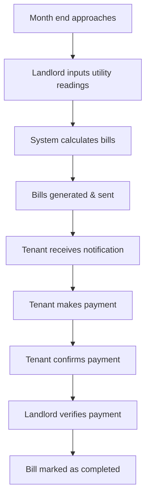
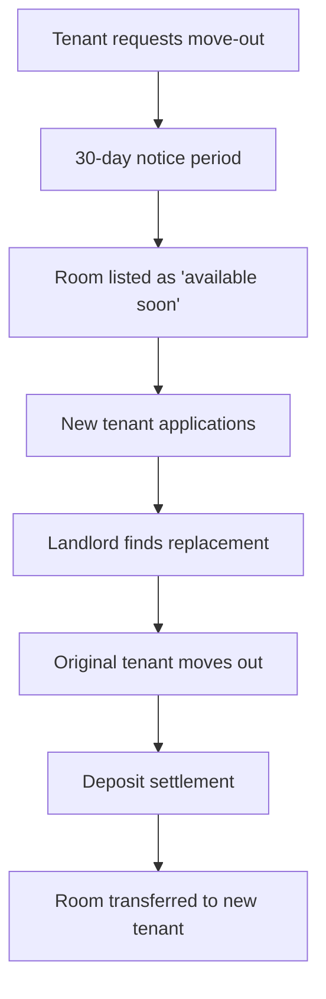

# Business Requirement Document (BRD) - English
## TacoLearn - Adaptive Japanese JLPT Learning Platform

---

## 1. Project Overview

### 1.1 Objectives

#### Primary Objectives
- **Enable personalized JLPT learning**: Create adaptive learning paths based on individual student performance
- **Automate weakness detection**: Analyze practice data to identify skill gaps automatically
- **Optimize study efficiency**: Recommend precisely what students should study next
- **Track mastery progression**: Monitor granular skill mastery at sub-skill levels
- **Implement spaced repetition**: Reinforce learning at scientifically optimal intervals

#### Secondary Objectives
- **Support classroom management**: Enable teachers to manage classes and track student progress
- **Enable offline readiness assessment**: Predict JLPT readiness through comprehensive data analysis
- **Mobile-first experience**: Responsive design optimized for on-the-go study sessions
- **Integration-ready architecture**: Future integration with payment systems and advanced analytics

### 1.2 Target Users

#### 1.2.1 Admin (Platform Administrator)
- **Primary responsibilities**: System oversight, user management, content moderation, analytics
- **User count**: 1-3 super admins
- **Technical proficiency**: High
- **Access level**: Full system access

#### 1.2.2 Teachers
- **Primary responsibilities**: Class management, lesson creation, student progress monitoring, assignment grading
- **User count**: 50-500 teachers
- **Technical proficiency**: Medium
- **Access level**: Class-specific access, student performance data
- **Characteristics**:
  - Age: 25-65 years
  - May teach 1-10 classes
  - Need mobile access for classroom management
  - Require analytics and reporting tools
  - Want to see student weakness patterns

#### 1.2.3 Students (Primary Users)
- **Primary responsibilities**: Study JLPT, practice questions, review lessons, track progress
- **User count**: 1,000-10,000+ students
- **Technical proficiency**: Low to Medium
- **Access level**: Personal dashboard, courses, practice data
- **Characteristics**:
  - Age: 18-50 years (diverse age range)
  - Mobile-first users
  - Motivated by progress visualization
  - Prefer guided study paths (not choices)
  - Seek clear improvement metrics

#### 1.2.4 Guests (Unregistered Visitors)
- **Primary responsibilities**: Browse available content, explore features
- **Access level**: Public content only, limited features
- **User count**: Unlimited
- **Technical proficiency**: Varies
- **Access level**: Public room listings only

### 1.3 Core Business Flows

#### 1.3.1 Room Rental Flow

#### 1.3.2 Monthly Billing Flow

#### 1.3.3 Move-out Flow

### 1.4 Business Rules & Constraints

#### 1.4.1 User Account Rules
- One email = One account = One role (Admin/Landlord/Tenant)
- Account deletion is soft delete only
- Tenants can be inactive but account remains for history

#### 1.4.2 Building & Room Rules
- Each building must have exactly one landlord
- Landlord ownership is at building level, not room level
- Room capacity is configurable by landlord
- Room status changes require landlord approval

#### 1.4.3 Billing Rules
- **Full Service Rooms**: Only monthly rent
- **Shared Service Rooms**: Rent + utilities + fees
- Billing date is configurable per building (default: 30th)
- Dual confirmation required: Tenant confirms → Landlord verifies
- Payment proof can be uploaded as image evidence

#### 1.4.4 Move-out Rules
- Minimum 30-day notice required
- Early move-out possible if replacement found
- Deposit refund after final bill settlement
- Room status changes: Available → Looking for tenant → Occupied

### 1.5 Expected Outcomes & KPIs

#### 1.5.1 Efficiency Metrics
- **Billing time reduction**: 80% reduction in manual billing time
- **Payment collection time**: 50% faster payment processing
- **Communication response time**: 90% of tenant queries resolved within 24 hours

#### 1.5.2 Financial Metrics
- **Payment delinquency rate**: <5% late payments
- **Occupancy rate**: >90% room occupancy
- **Revenue transparency**: 100% of transactions recorded and trackable

#### 1.5.3 User Satisfaction Metrics
- **Landlord satisfaction**: >4.5/5 rating for management efficiency
- **Tenant satisfaction**: >4.0/5 rating for transparency and ease of use
- **Support ticket resolution**: <2 hours average response time

#### 1.5.4 Technical Metrics
- **System uptime**: 99.5% availability
- **Mobile usage**: >70% of tenant interactions via mobile
- **Data accuracy**: <1% billing calculation errors

### 1.6 Non-Functional Requirements

#### 1.6.1 Performance
- Page load time: <3 seconds
- API response time: <500ms
- Support 1000 concurrent users

#### 1.6.2 Security
- Data encryption at rest and in transit
- Secure payment processing (PCI compliance)
- Regular security audits and penetration testing

#### 1.6.3 Scalability
- Support 10,000+ rooms across 1,000+ buildings
- Horizontal scaling capability
- Multi-region deployment ready

#### 1.6.4 Compliance
- Data privacy compliance (GDPR-ready)
- Financial transaction logging
- Audit trail for all critical operations