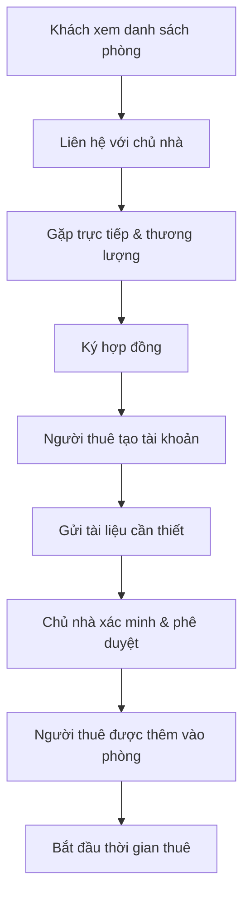
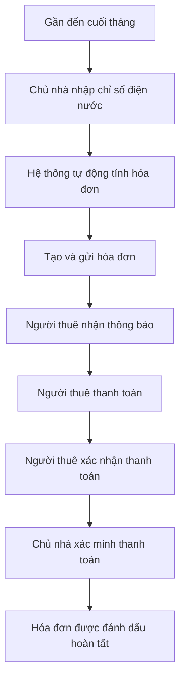

# Tài liệu Yêu cầu Kinh doanh (BRD)

## Tacohouse - Hệ thống Quản lý Phòng Cho Thuê

---

### 1.1 Mục tiêu Dự án

#### Mục tiêu Chính

* **Số hóa quản lý nhà trọ**: Chuyển đổi việc quản lý thủ công bằng giấy tờ sang nền tảng kỹ thuật số
* **Tự động hóa quy trình tính tiền**: Tự động tính toán hóa đơn hàng tháng phức tạp cho các loại phòng khác nhau
* **Cải thiện giao tiếp**: Cung cấp hệ thống nhắn tin thời gian thực giữa chủ nhà và người thuê
* **Tăng tính minh bạch**: Hiển thị rõ ràng lịch sử thanh toán và cơ chế xác nhận hai bên
* **Giảm khối lượng công việc hành chính**: Tự động gửi thông báo, nhắc thanh toán, và quản lý tài liệu

#### Mục tiêu Phụ

* **Khả năng mở rộng**: Hỗ trợ nhiều tòa nhà và nhiều chủ nhà trên cùng một nền tảng
* **Khả năng truy cập qua thiết bị di động**: Thiết kế giao diện đáp ứng (responsive) cho việc sử dụng trên điện thoại
* **Phân tích dữ liệu**: Cung cấp báo cáo về tỷ lệ lấp đầy, thói quen thanh toán
* **Sẵn sàng tích hợp**: Hỗ trợ tích hợp trong tương lai với hệ thống ngân hàng và cổng thanh toán

---

### 1.2 Người Dùng Mục Tiêu

#### 1.2.1 Quản trị viên hệ thống (Admin)

* **Trách nhiệm chính**: Giám sát hệ thống, quản lý người dùng, xử lý tranh chấp
* **Số lượng người dùng**: 1–3 quản trị viên
* **Trình độ kỹ thuật**: Cao
* **Quyền truy cập**: Toàn bộ hệ thống

#### 1.2.2 Chủ nhà (Landlord)

* **Trách nhiệm chính**: Quản lý tòa nhà, thêm người thuê, tạo hóa đơn, bảo trì
* **Số lượng người dùng**: 50–500 chủ nhà
* **Trình độ kỹ thuật**: Trung bình
* **Quyền truy cập**: Giới hạn theo từng tòa nhà
* **Đặc điểm**:

  * Tuổi: 25–65
  * Quản lý từ 1–20 tòa nhà
  * Cần truy cập di động để quản lý tại chỗ
  * Ưu tiên giao diện đơn giản, dễ sử dụng

#### 1.2.3 Người thuê (Tenant)

* **Trách nhiệm chính**: Xem hóa đơn, thanh toán, giao tiếp với chủ nhà
* **Số lượng người dùng**: 1.000–10.000 người
* **Trình độ kỹ thuật**: Thấp đến Trung bình
* **Quyền truy cập**: Chỉ trong phạm vi dữ liệu cá nhân và phòng hiện tại
* **Đặc điểm**:

  * Tuổi: 18–35 (chủ yếu là sinh viên, người đi làm trẻ)
  * Thói quen sử dụng: ưu tiên thiết bị di động
  * Nhạy cảm về giá cả
  * Cần quy trình thanh toán rõ ràng, đơn giản

#### 1.2.4 Khách truy cập (Guest)

* **Trách nhiệm chính**: Xem danh sách các phòng trống
* **Số lượng người dùng**: Không giới hạn
* **Trình độ kỹ thuật**: Đa dạng
* **Quyền truy cập**: Chỉ xem thông tin công khai về phòng

---

### 1.3 Luồng Kinh Doanh Cốt Lõi

#### 1.3.1 Luồng Thuê Phòng



#### 1.3.2 Luồng Thanh Toán Hàng Tháng



#### 1.3.3 Luồng Trả Phòng

```mermaid
graph TD
    A[Người thuê yêu cầu trả phòng] --> B[Thông báo trước 30 ngày]
    B --> C[Phòng được đánh dấu "sắp trống"]
    C --> D[Nhận đơn thuê mới]
    D --> E[Chủ nhà chọn người thuê mới]
    E --> F[Người thuê cũ chuyển đi]
    F --> G[Hoàn tiền đặt cọc]
    G --> H[Phòng được bàn giao cho người thuê mới]
```

---

### 1.4 Quy tắc và Ràng buộc Kinh doanh

#### 1.4.1 Quy tắc Tài khoản Người dùng

* Một email = Một tài khoản = Một vai trò (Admin/Chủ nhà/Người thuê)
* Xóa tài khoản chỉ là **xóa mềm (soft delete)**
* Tài khoản người thuê có thể bị vô hiệu hóa nhưng vẫn giữ lại lịch sử

#### 1.4.2 Quy tắc về Tòa nhà & Phòng

* Mỗi tòa nhà phải có **chính xác một chủ nhà**
* Quyền sở hữu thuộc về **tòa nhà**, không phải từng phòng
* Sức chứa phòng có thể cấu hình bởi chủ nhà
* Thay đổi trạng thái phòng cần được chủ nhà phê duyệt

#### 1.4.3 Quy tắc Thanh toán

* **Phòng dịch vụ đầy đủ**: Chỉ có tiền thuê hàng tháng
* **Phòng chia sẻ**: Tiền thuê + tiền điện nước + các loại phí khác
* Ngày lập hóa đơn có thể cấu hình (mặc định: ngày 30 hàng tháng)
* Cơ chế xác nhận hai bước: Người thuê xác nhận → Chủ nhà kiểm tra lại
* Có thể **tải lên hình ảnh bằng chứng thanh toán**

#### 1.4.4 Quy tắc Trả Phòng

* Cần thông báo trước **ít nhất 30 ngày**
* Có thể rời sớm nếu tìm được người thay thế
* Tiền đặt cọc được hoàn lại sau khi tất toán hóa đơn cuối cùng
* Trạng thái phòng: *Trống → Đang tìm người thuê → Đã có người thuê*

---

### 1.5 Kết quả Mong đợi & Chỉ số Đánh giá (KPI)

#### 1.5.1 Hiệu quả Vận hành

* **Giảm thời gian lập hóa đơn**: 80% so với thủ công
* **Rút ngắn thời gian thu tiền**: Nhanh hơn 50%
* **Phản hồi nhanh hơn**: 90% yêu cầu của người thuê được trả lời trong 24h

#### 1.5.2 Hiệu quả Tài chính

* **Tỷ lệ chậm thanh toán**: <5%
* **Tỷ lệ lấp đầy phòng**: >90%
* **Minh bạch doanh thu**: 100% giao dịch được ghi lại và theo dõi

#### 1.5.3 Mức độ Hài lòng Người dùng

* **Chủ nhà**: Điểm hài lòng >4.5/5 về hiệu quả quản lý
* **Người thuê**: Điểm hài lòng >4.0/5 về tính minh bạch và dễ sử dụng
* **Hỗ trợ kỹ thuật**: Thời gian phản hồi trung bình <2 giờ

#### 1.5.4 Hiệu suất Kỹ thuật

* **Thời gian hoạt động hệ thống (uptime)**: ≥99.5%
* **Tỷ lệ sử dụng trên thiết bị di động**: >70% người thuê
* **Độ chính xác tính hóa đơn**: Sai số <1%

---

### 1.6 Yêu cầu Phi chức năng

#### 1.6.1 Hiệu năng

* Thời gian tải trang: <3 giây
* Thời gian phản hồi API: <500ms
* Hỗ trợ 1.000 người dùng đồng thời

#### 1.6.2 Bảo mật

* Mã hóa dữ liệu khi lưu trữ và khi truyền
* Xử lý thanh toán an toàn (đạt chuẩn PCI)
* Kiểm tra và đánh giá bảo mật định kỳ

#### 1.6.3 Khả năng Mở rộng

* Hỗ trợ hơn **10.000 phòng** trên **1.000 tòa nhà**
* Có thể mở rộng theo chiều ngang (horizontal scaling)
* Sẵn sàng triển khai đa vùng (multi-region)

#### 1.6.4 Tuân thủ

* Tuân thủ bảo mật dữ liệu cá nhân (GDPR-ready)
* Ghi nhật ký mọi giao dịch tài chính
* Có **lịch sử kiểm toán (audit trail)** cho các hoạt động quan trọng
