# Use Case Diagram & Specifications
## Tacohouse - Rental Room Management System

### 2.1 Use Case Diagram

```mermaid
graph TB
    subgraph "Tacohouse System"
        subgraph "Admin Functions"
            UC1[Manage System Users]
            UC2[System Configuration]
            UC3[Generate Reports]
            UC4[Handle Disputes]
        end
        
        subgraph "Landlord Functions"
            UC5[Manage Buildings]
            UC6[Manage Rooms]
            UC7[Tenant Management]
            UC8[Generate Bills]
            UC9[Process Payments]
            UC10[Handle Requests]
            UC11[Send Announcements]
        end
        
        subgraph "Tenant Functions"
            UC12[View Bills]
            UC13[Make Payments]
            UC14[Submit Requests]
            UC15[Room Communication]
            UC16[Request Move-out]
        end
        
        subgraph "Guest Functions"
            UC17[Browse Rooms]
            UC18[Contact Landlord]
        end
        
        subgraph "Shared Functions"
            UC19[Authentication]
            UC20[Real-time Chat]
            UC21[Notifications]
        end
    end
    
    Admin --> UC1
    Admin --> UC2
    Admin --> UC3
    Admin --> UC4
    Admin --> UC19
    
    Landlord --> UC5
    Landlord --> UC6
    Landlord --> UC7
    Landlord --> UC8
    Landlord --> UC9
    Landlord --> UC10
    Landlord --> UC11
    Landlord --> UC19
    Landlord --> UC20
    Landlord --> UC21
    
    Tenant --> UC12
    Tenant --> UC13
    Tenant --> UC14
    Tenant --> UC15
    Tenant --> UC16
    Tenant --> UC19
    Tenant --> UC20
    Tenant --> UC21
    
    Guest --> UC17
    Guest --> UC18
```

### 2.2 Detailed Use Case Specifications

#### UC8: Generate Bills (Critical Use Case)

**Use Case ID**: UC8  
**Use Case Name**: Generate Monthly Bills  
**Primary Actor**: Landlord  
**Stakeholders**: Tenant, System  
**Preconditions**: 
- Landlord is authenticated
- Month-end billing period has arrived
- Utility readings are available

**Main Success Scenario**:
1. Landlord selects building for billing
2. System displays all active rooms in building
3. Landlord inputs utility readings for each room:
   - Electricity meter reading
   - Water meter reading  
   - Gas meter reading
4. System calculates usage based on previous readings
5. System applies building-specific rates
6. System calculates total bill for each room type:
   - **Full Service**: Monthly rent only
   - **Shared Service**: Rent + utilities + management fees + cleaning fees + lighting fees
7. Landlord reviews calculated bills
8. Landlord confirms and generates bills
9. System sends notifications to all tenants
10. System sends email reminders

**Alternative Flows**:
- **A1**: Missing utility readings
  - System prompts landlord to input missing readings
  - Landlord can use estimated readings with notes
- **A2**: Calculation errors detected
  - System highlights inconsistencies
  - Landlord can manually adjust with justification

**Exception Flows**:
- **E1**: System calculation failure
  - Error logged and admin notified
  - Landlord can generate bills manually
- **E2**: Email service unavailable
  - Bills generated but notifications queued for retry

**Postconditions**:
- Bills created and stored in system
- Tenants notified via app and email
- Billing cycle recorded for audit

#### UC13: Make Payments (Critical Use Case)

**Use Case ID**: UC13  
**Use Case Name**: Make Monthly Payment  
**Primary Actor**: Tenant  
**Stakeholders**: Landlord, Payment Gateway  
**Preconditions**:
- Tenant is authenticated
- Active bill exists for current month
- Payment methods are available

**Main Success Scenario**:
1. Tenant views outstanding bills
2. Tenant selects bill to pay
3. System displays bill breakdown:
   - Base rent
   - Utility costs (if applicable)
   - Additional fees
   - Previous debt (if any)
4. Tenant chooses payment method:
   - Cash (mark as paid manually)
   - Bank transfer
   - Stripe payment
5. For online payments:
   - Tenant enters payment details
   - System processes payment via Stripe
   - Payment confirmation received
6. Tenant uploads payment proof (optional)
7. Tenant marks bill as "Tenant Confirmed"
8. System notifies landlord of payment claim
9. Landlord verifies and confirms payment
10. Bill status updated to "Completed"

**Alternative Flows**:
- **A1**: Partial payment
  - Tenant pays partial amount
  - Remaining balance carried to next month
- **A2**: Payment from deposit
  - Tenant requests payment from security deposit
  - Landlord approves/rejects request

**Exception Flows**:
- **E1**: Payment gateway failure
  - Transaction rolled back
  - User notified to retry
- **E2**: Insufficient funds
  - Payment declined
  - Alternative payment methods suggested

**Postconditions**:
- Payment recorded in system
- Landlord notified for verification
- Receipt generated for tenant

#### UC16: Request Move-out

**Use Case ID**: UC16  
**Use Case Name**: Request Move-out  
**Primary Actor**: Tenant  
**Stakeholders**: Landlord, Future Tenants  
**Preconditions**:
- Tenant is authenticated
- Tenant has active room assignment
- No outstanding bills exist

**Main Success Scenario**:
1. Tenant accesses move-out request form
2. Tenant selects intended move-out date (minimum 30 days)
3. Tenant provides reason for move-out
4. Tenant confirms understanding of deposit policy
5. System validates 30-day notice requirement
6. Move-out request submitted
7. System updates room status to "Looking for tenant before current leaves"
8. Room becomes visible on public listings with "Available from" date
9. Landlord receives notification
10. Landlord can approve early move-out if replacement found

**Alternative Flows**:
- **A1**: Outstanding bills exist
  - System prevents move-out request
  - Tenant prompted to settle bills first
- **A2**: Less than 30-day notice
  - System warns about policy violation
  - Tenant can submit with penalty acceptance

**Exception Flows**:
- **E1**: Emergency move-out
  - Tenant can submit immediate move-out with explanation
  - Requires admin or landlord approval

**Postconditions**:
- Move-out request recorded
- Room status updated
- Landlord and relevant parties notified
- Public listing updated with availability date