# Sơ đồ và Đặc tả Use Case

## Tacohouse - Hệ thống Quản lý Phòng Cho Thuê

---

### 2.1 Sơ đồ Use Case

```mermaid
graph TB
    subgraph "Hệ thống Tacohouse"
        subgraph "Chức năng của Quản trị viên (Admin)"
            UC1[Quản lý người dùng hệ thống]
            UC2[Cấu hình hệ thống]
            UC3[Tạo báo cáo]
            UC4[Xử lý tranh chấp]
        end
        
        subgraph "Chức năng của Chủ nhà (Landlord)"
            UC5[Quản lý tòa nhà]
            UC6[Quản lý phòng]
            UC7[Quản lý người thuê]
            UC8[Tạo hóa đơn]
            UC9[Xử lý thanh toán]
            UC10[Xử lý yêu cầu]
            UC11[Gửi thông báo]
        end
        
        subgraph "Chức năng của Người thuê (Tenant)"
            UC12[Xem hóa đơn]
            UC13[Thanh toán]
            UC14[Gửi yêu cầu]
            UC15[Trao đổi trong phòng]
            UC16[Yêu cầu trả phòng]
        end
        
        subgraph "Chức năng của Khách truy cập (Guest)"
            UC17[Xem danh sách phòng]
            UC18[Liên hệ với chủ nhà]
        end
        
        subgraph "Chức năng dùng chung"
            UC19[Xác thực - Đăng nhập/Đăng ký]
            UC20[Trò chuyện thời gian thực]
            UC21[Nhận thông báo]
        end
    end
    
    Admin --> UC1
    Admin --> UC2
    Admin --> UC3
    Admin --> UC4
    Admin --> UC19
    
    Landlord --> UC5
    Landlord --> UC6
    Landlord --> UC7
    Landlord --> UC8
    Landlord --> UC9
    Landlord --> UC10
    Landlord --> UC11
    Landlord --> UC19
    Landlord --> UC20
    Landlord --> UC21
    
    Tenant --> UC12
    Tenant --> UC13
    Tenant --> UC14
    Tenant --> UC15
    Tenant --> UC16
    Tenant --> UC19
    Tenant --> UC20
    Tenant --> UC21
    
    Guest --> UC17
    Guest --> UC18
```

---

### 2.2 Đặc tả chi tiết Use Case

---

#### **UC8: Tạo hóa đơn (Use Case quan trọng)**

**Mã Use Case**: UC8
**Tên Use Case**: Tạo hóa đơn hàng tháng
**Tác nhân chính**: Chủ nhà (Landlord)
**Các bên liên quan**: Người thuê, Hệ thống
**Điều kiện tiên quyết**:

* Chủ nhà đã đăng nhập
* Đến kỳ lập hóa đơn cuối tháng
* Có sẵn dữ liệu chỉ số điện/nước

**Kịch bản thành công chính**:

1. Chủ nhà chọn tòa nhà để lập hóa đơn
2. Hệ thống hiển thị tất cả các phòng đang được thuê trong tòa nhà
3. Chủ nhà nhập chỉ số tiêu thụ của từng phòng:

   * Chỉ số điện
   * Chỉ số nước
   * Chỉ số gas (nếu có)
4. Hệ thống tính mức sử dụng dựa trên chỉ số kỳ trước
5. Hệ thống áp dụng đơn giá cụ thể của tòa nhà
6. Hệ thống tính tổng hóa đơn cho từng loại phòng:

   * **Phòng dịch vụ đầy đủ**: chỉ có tiền thuê
   * **Phòng chia sẻ**: tiền thuê + tiền điện/nước + phí quản lý + phí dọn dẹp + phí chiếu sáng
7. Chủ nhà xem và kiểm tra lại hóa đơn đã tính
8. Chủ nhà xác nhận để tạo hóa đơn
9. Hệ thống gửi thông báo cho tất cả người thuê
10. Hệ thống gửi email nhắc thanh toán

**Luồng thay thế**:

* **A1**: Thiếu chỉ số điện/nước

  * Hệ thống yêu cầu nhập bổ sung
  * Chủ nhà có thể nhập ước tính kèm ghi chú
* **A2**: Phát hiện lỗi tính toán

  * Hệ thống đánh dấu phần bất thường
  * Chủ nhà có thể chỉnh sửa thủ công kèm lý do

**Luồng ngoại lệ**:

* **E1**: Lỗi hệ thống khi tính toán

  * Hệ thống ghi log lỗi và thông báo cho quản trị viên
  * Chủ nhà có thể lập hóa đơn thủ công
* **E2**: Dịch vụ gửi email bị lỗi

  * Hóa đơn vẫn được tạo, nhưng thông báo sẽ được gửi lại sau

**Kết quả sau khi hoàn thành**:

* Hóa đơn được tạo và lưu trong hệ thống
* Người thuê được thông báo qua ứng dụng và email
* Chu kỳ lập hóa đơn được ghi nhận phục vụ kiểm toán

---

#### **UC13: Thanh toán (Use Case quan trọng)**

**Mã Use Case**: UC13
**Tên Use Case**: Thanh toán hàng tháng
**Tác nhân chính**: Người thuê (Tenant)
**Các bên liên quan**: Chủ nhà, Cổng thanh toán
**Điều kiện tiên quyết**:

* Người thuê đã đăng nhập
* Có hóa đơn đang hoạt động trong tháng hiện tại
* Các phương thức thanh toán khả dụng

**Kịch bản thành công chính**:

1. Người thuê xem danh sách hóa đơn chưa thanh toán
2. Người thuê chọn hóa đơn muốn thanh toán
3. Hệ thống hiển thị chi tiết hóa đơn gồm:

   * Tiền thuê cơ bản
   * Tiền điện/nước (nếu có)
   * Các khoản phí khác
   * Nợ kỳ trước (nếu có)
4. Người thuê chọn phương thức thanh toán:

   * Tiền mặt (chủ nhà xác nhận thủ công)
   * Chuyển khoản ngân hàng
   * Thanh toán qua Stripe
5. Nếu là thanh toán online:

   * Người thuê nhập thông tin thanh toán
   * Hệ thống xử lý qua Stripe
   * Xác nhận thanh toán được nhận
6. Người thuê tải lên bằng chứng thanh toán (tùy chọn)
7. Người thuê đánh dấu hóa đơn là “Đã xác nhận thanh toán”
8. Hệ thống gửi thông báo cho chủ nhà
9. Chủ nhà kiểm tra và xác nhận thanh toán
10. Trạng thái hóa đơn chuyển thành “Hoàn tất”

**Luồng thay thế**:

* **A1**: Thanh toán một phần

  * Người thuê trả một phần tiền
  * Phần còn lại chuyển sang kỳ sau
* **A2**: Thanh toán bằng tiền đặt cọc

  * Người thuê yêu cầu trừ vào tiền cọc
  * Chủ nhà phê duyệt hoặc từ chối yêu cầu

**Luồng ngoại lệ**:

* **E1**: Lỗi cổng thanh toán

  * Giao dịch bị hủy
  * Hệ thống thông báo để người dùng thử lại
* **E2**: Không đủ tiền

  * Giao dịch bị từ chối
  * Hệ thống gợi ý phương thức khác

**Kết quả sau khi hoàn thành**:

* Thanh toán được ghi nhận
* Chủ nhà được thông báo để xác minh
* Biên lai được tạo cho người thuê

---

#### **UC16: Yêu cầu trả phòng**

**Mã Use Case**: UC16
**Tên Use Case**: Yêu cầu trả phòng
**Tác nhân chính**: Người thuê (Tenant)
**Các bên liên quan**: Chủ nhà, Người thuê tiềm năng
**Điều kiện tiên quyết**:

* Người thuê đã đăng nhập
* Đang có phòng đang thuê
* Không có hóa đơn chưa thanh toán

**Kịch bản thành công chính**:

1. Người thuê truy cập biểu mẫu yêu cầu trả phòng
2. Chọn ngày dự kiến rời đi (ít nhất 30 ngày kể từ ngày hiện tại)
3. Nhập lý do trả phòng
4. Xác nhận đã hiểu chính sách hoàn tiền đặt cọc
5. Hệ thống kiểm tra điều kiện thông báo trước 30 ngày
6. Gửi yêu cầu trả phòng
7. Hệ thống cập nhật trạng thái phòng là “Đang tìm người thuê mới trước khi người hiện tại rời đi”
8. Phòng hiển thị trên danh sách công khai với ngày “Có thể thuê từ”
9. Chủ nhà nhận được thông báo
10. Chủ nhà có thể phê duyệt rời sớm nếu có người thay thế

**Luồng thay thế**:

* **A1**: Có hóa đơn chưa thanh toán

  * Hệ thống chặn gửi yêu cầu
  * Người thuê được nhắc thanh toán trước
* **A2**: Thông báo trước ít hơn 30 ngày

  * Hệ thống cảnh báo vi phạm chính sách
  * Người thuê có thể tiếp tục gửi yêu cầu với việc chấp nhận phạt

**Luồng ngoại lệ**:

* **E1**: Trả phòng khẩn cấp

  * Người thuê gửi yêu cầu rời ngay lập tức kèm lý do
  * Cần phê duyệt bởi chủ nhà hoặc quản trị viên

**Kết quả sau khi hoàn thành**:

* Yêu cầu trả phòng được ghi lại
* Trạng thái phòng được cập nhật
* Chủ nhà và các bên liên quan được thông báo
* Danh sách công khai được cập nhật với ngày có thể thuê mới
