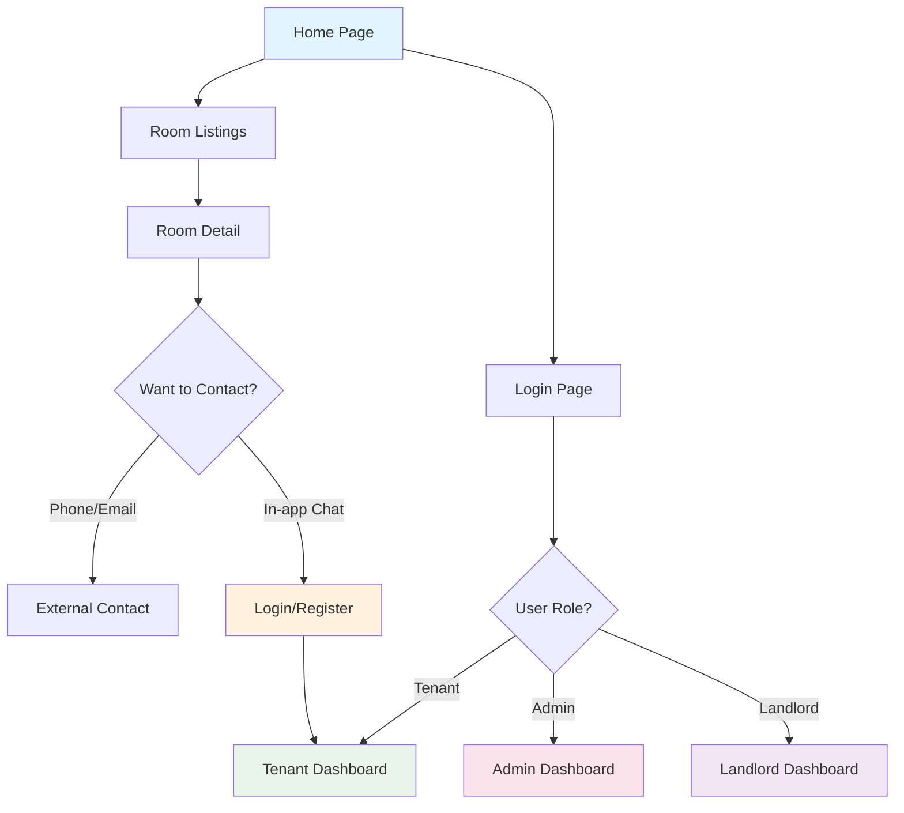
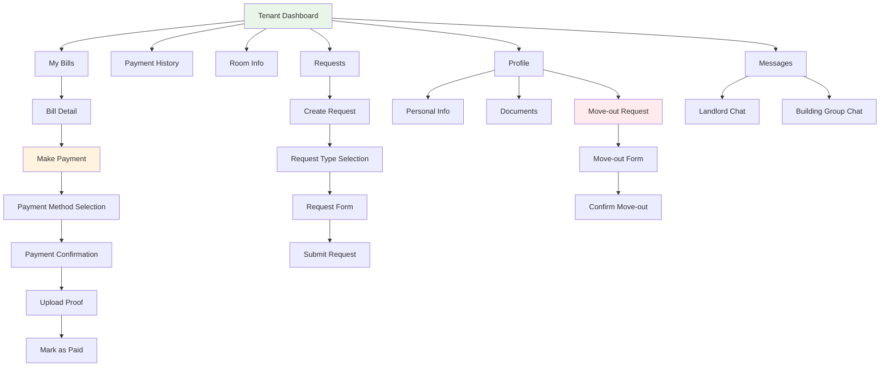
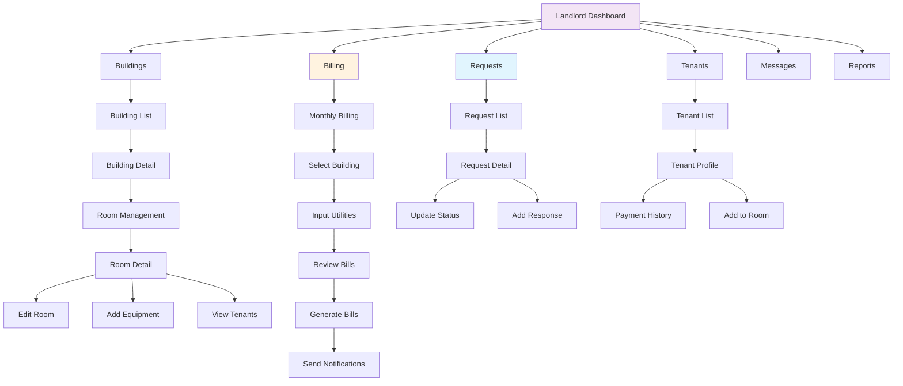
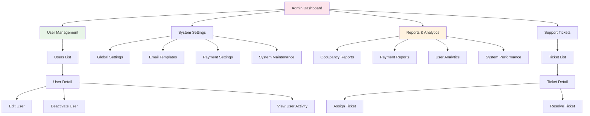
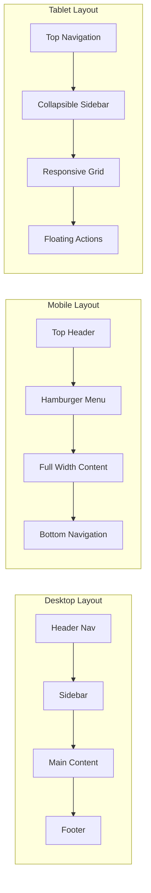
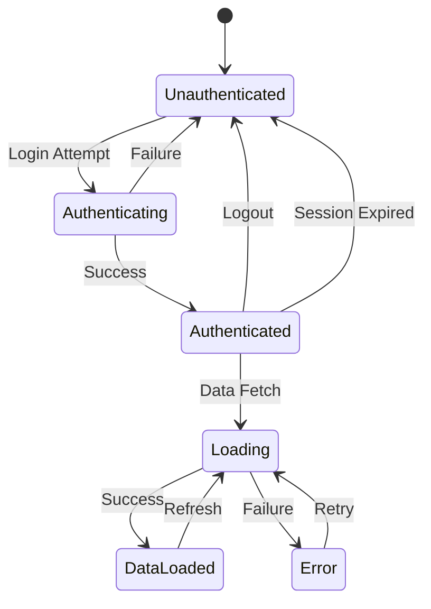

# Screen Transition Diagram (画面遷移図)
## Tacohouse - Rental Room Management System

### 3.1 Guest User Flow

### 3.2 Tenant User Flow

### 3.3 Landlord User Flow

### 3.4 Admin User Flow

### 3.5 Mobile Responsive Patterns

### 3.6 State Management Flow

