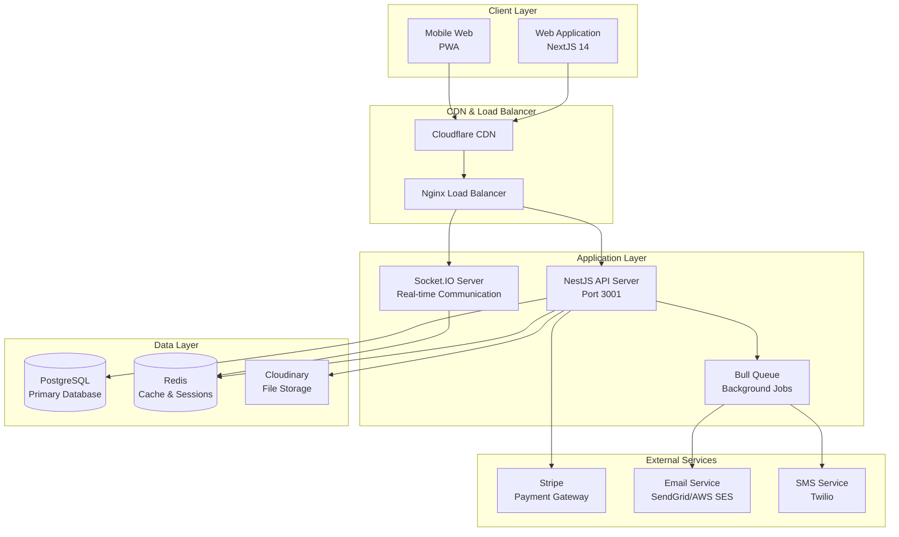
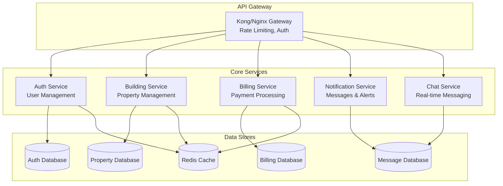
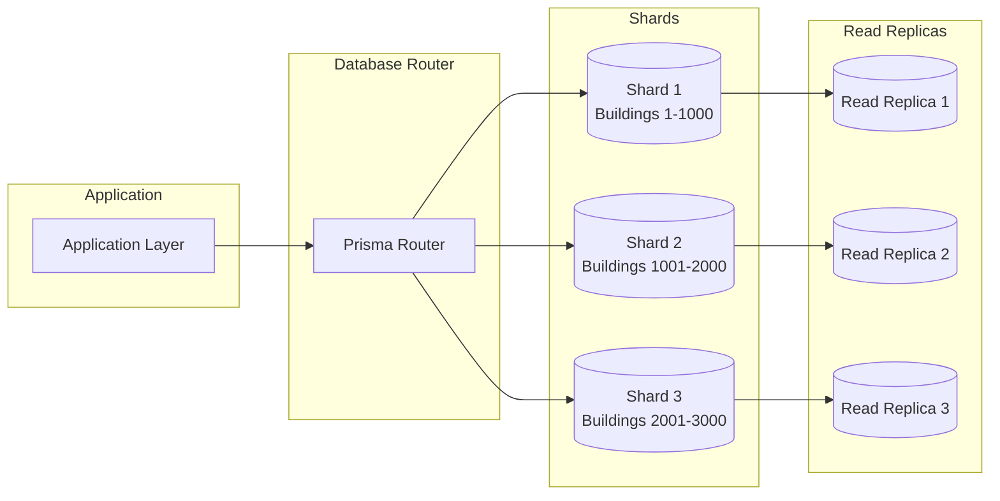
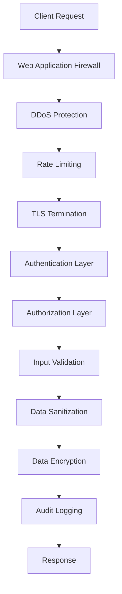

# System Architecture Document (システム構成設計書)
## Tacohouse - Rental Room Management System

### 4.1 High-Level Architecture Overview



### 4.2 Technology Stack Details

#### 4.2.1 Frontend Stack
```typescript
// Technology choices and rationale
const frontendStack = {
  framework: "NextJS 14",
  rationale: "App Router, Server Components, Built-in optimization",
  
  styling: "Tailwind CSS + Shadcn/ui",
  rationale: "Utility-first, component library, design consistency",
  
  stateManagement: {
    server: "TanStack Query",
    client: "Zustand",
    rationale: "Server state caching + Simple client state"
  },
  
  formHandling: "React Hook Form + Zod",
  rationale: "Performance + Type-safe validation",
  
  realtime: "Socket.IO Client",
  rationale: "Reliable WebSocket with fallbacks"
}
```

#### 4.2.2 Backend Stack
```typescript
// NestJS Architecture
const backendStack = {
  framework: "NestJS 10",
  rationale: "Enterprise-ready, decorator-based, modular",
  
  database: {
    orm: "Prisma",
    db: "PostgreSQL 15",
    rationale: "Type-safe queries + ACID compliance"
  },
  
  authentication: "JWT + Passport",
  rationale: "Stateless + Strategy pattern",
  
  realtime: "Socket.IO",
  rationale: "Cross-platform WebSocket support",
  
  queues: "Bull + Redis",
  rationale: "Reliable background job processing",
  
  validation: "class-validator + class-transformer",
  rationale: "Decorator-based validation + serialization"
}
```

### 4.3 Microservice Architecture (Future)



### 4.4 Database Architecture

#### 4.4.1 Database Sharding Strategy


#### 4.4.2 Caching Strategy
```typescript
// Multi-layer caching approach
const cachingStrategy = {
  levels: {
    l1: {
      type: "Application Cache",
      technology: "Node.js Memory",
      ttl: "5 minutes",
      use: "Frequently accessed small data"
    },
    l2: {
      type: "Distributed Cache", 
      technology: "Redis",
      ttl: "1 hour",
      use: "Session data, API responses"
    },
    l3: {
      type: "CDN Cache",
      technology: "Cloudflare",
      ttl: "24 hours", 
      use: "Static assets, images"
    }
  },
  
  patterns: {
    cacheAside: "Manual cache management",
    writeThrough: "Billing data consistency",
    writeBack: "Non-critical updates"
  }
}
```

### 4.5 Security Architecture



### 4.6 Deployment Architecture

#### 4.6.1 Container Architecture
```dockerfile
# Multi-stage build example
FROM node:18-alpine AS base
WORKDIR /app
COPY package*.json ./
RUN npm ci --only=production

FROM base AS development
RUN npm ci
COPY . .
EXPOSE 3000
CMD ["npm", "run", "dev"]

FROM base AS production
COPY . .
RUN npm run build
EXPOSE 3000
CMD ["npm", "start"]
```

#### 4.6.2 Kubernetes Deployment
```yaml
# Kubernetes deployment structure
apiVersion: apps/v1
kind: Deployment
metadata:
  name: tacohouse-api
spec:
  replicas: 3
  selector:
    matchLabels:
      app: tacohouse-api
  template:
    metadata:
      labels:
        app: tacohouse-api
    spec:
      containers:
      - name: api
        image: tacohouse/api:latest
        ports:
        - containerPort: 3001
        env:
        - name: DATABASE_URL
          valueFrom:
            secretKeyRef:
              name: database-secret
              key: url
```

### 4.7 Performance Specifications

| Component | Specification | Monitoring |
|-----------|---------------|------------|
| **API Response Time** | < 500ms (95th percentile) | Prometheus + Grafana |
| **Database Query Time** | < 100ms (average) | Prisma metrics |
| **Page Load Time** | < 3 seconds (LCP) | Lighthouse CI |
| **Memory Usage** | < 512MB per container | Kubernetes metrics |
| **CPU Usage** | < 80% under normal load | Container monitoring |
| **Concurrent Users** | 1000+ simultaneous users | Load testing |
| **Uptime** | 99.9% availability | Health checks |

### 4.8 Scalability Plan

#### Phase 1: Vertical Scaling (0-1K users)
- Single server deployment
- Shared database
- Basic caching

#### Phase 2: Horizontal Scaling (1K-10K users)
- Load balancer + multiple app instances
- Database read replicas
- Redis cluster

#### Phase 3: Microservices (10K+ users)
- Service decomposition
- Database sharding
- Event-driven architecture
- Auto-scaling groups