# Database Design Document (DB設計書)
## Tacohouse - Rental Room Management System

### 5.1 Database Schema Overview

```mermaid
erDiagram
    User ||--o{ Admin : "can be admin"
    User ||--o{ Landlord : "can be landlord"
    User ||--o{ Tenant : "can be tenant"
    User ||--|| UserProfile : "has profile"
    User ||--o{ Message : "sends/receives"
    User ||--o{ Notification : "receives"
    User ||--o{ ChatGroupMember : "participates in"
    
    Landlord ||--o{ Building : "owns"
    
    Building ||--o{ Room : "contains"
    Building ||--|| ChatGroup : "has group chat"
    
    Room ||--o{ Rental : "rented through"
    Room ||--o{ RoomEquipment : "contains equipment"
    Room ||--o{ UtilityRecord : "tracks utilities"
    Room ||--o{ Bill : "generates bills"
    Room ||--o{ MaintenanceRequest : "has requests"
    
    Tenant ||--o{ Rental : "rents rooms"
    Tenant ||--o{ MaintenanceRequest : "submits"
    Tenant ||--o{ PaymentConfirmation : "confirms payment"
    
    Bill ||--o| Payment : "paid via"
    Bill ||--o| PaymentConfirmation : "confirmed by"
    
    ChatGroup ||--o{ ChatGroupMember : "has members"
    ChatGroup ||--o{ Message : "contains messages"
    
    User {
        string id PK "CUID primary key"
        string email UK "Unique email address"
        string password "Hashed password"
        enum role "ADMIN|LANDLORD|TENANT"
        boolean isActive "Account status - default true"
        datetime deletedAt "Soft delete timestamp - optional"
        datetime createdAt "Record creation time"
        datetime updatedAt "Last modification time"
    }
    
    UserProfile {
        string id PK "CUID primary key"
        string userId FK "One-to-one with User - unique constraint"
        string firstName "Given name"
        string lastName "Family name"
        string phone "Contact number"
        string avatar "Profile picture URL"
        datetime dateOfBirth "Birth date"
        string occupation "Job title/profession"
        string workplace "Company/workplace"
        string idCardFrontPhoto "ID document front - optional"
        string idCardBackPhoto "ID document back - optional"
        string portraitPhoto "Portrait for verification - optional"
        datetime createdAt "Record creation time"
        datetime updatedAt "Last modification time"
    }
    
    Admin {
        string id PK "CUID primary key"
        string userId FK "One-to-one with User - unique constraint"
    }
    
    Landlord {
        string id PK "CUID primary key"
        string userId FK "One-to-one with User - unique constraint"
    }
    
    Tenant {
        string id PK "CUID primary key"
        string userId FK "One-to-one with User - unique constraint"
    }
    
    Building {
        string id PK "CUID primary key"
        string name "Building name/identifier"
        string address "Full street address"
        string description "Building description - optional"
        int billingDate "Day of month for billing (1-31) - optional"
        string landlordId FK "Owner reference"
        decimal electricityRate "Cost per kWh - default 0"
        decimal waterRate "Cost per cubic meter - default 0"
        decimal gasRate "Cost per cubic meter - default 0"
        decimal managementFee "Fixed monthly fee - default 0"
        decimal cleaningFeePerPerson "Per person monthly - default 0"
        decimal lightingFee "Fixed monthly fee - default 0"
        datetime createdAt "Record creation time"
        datetime updatedAt "Last modification time"
    }
    
    Room {
        string id PK "CUID primary key"
        string number "Room identifier within building"
        string buildingId FK "Building reference"
        decimal area "Room size in square meters"
        decimal monthlyRent "Base monthly rent amount"
        decimal deposit "Security deposit - default 0"
        int maxTenants "Maximum occupancy - default 1"
        enum roomType "FULL_RIGHTS|PARTIAL_RIGHTS"
        string description "Room details - optional"
        string[] images "Array of image URLs"
        enum status "AVAILABLE|OCCUPIED|PENDING_CHECKOUT|MAINTENANCE"
        datetime availableFrom "Availability date - optional"
        datetime createdAt "Record creation time"
        datetime updatedAt "Last modification time"
    }
    
    RoomEquipment {
        string id PK "CUID primary key"
        string roomId FK "Room reference"
        string name "Equipment name (washing machine, etc.)"
        string description "Equipment details - optional"
        string brand "Manufacturer - optional"
        string model "Model number - optional"
        datetime installedDate "Installation date - optional"
        datetime warrantyExpiryDate "Warranty end date - optional"
        enum condition "EXCELLENT|GOOD|FAIR|POOR|BROKEN - default GOOD"
        datetime createdAt "Record creation time"
        datetime updatedAt "Last modification time"
    }
    
    Rental {
        string id PK "CUID primary key"
        string tenantId FK "Tenant reference"
        string roomId FK "Room reference"
        datetime startDate "Rental start date"
        datetime endDate "Rental end date - optional"
        datetime noticeDate "Move-out notice date - optional"
        decimal monthlyRent "Agreed monthly rent"
        decimal depositPaid "Deposit amount paid - default 0"
        enum status "ACTIVE|NOTICE_GIVEN|TERMINATED - default ACTIVE"
        string[] contractImages "Contract document images"
        datetime createdAt "Record creation time"
        datetime updatedAt "Last modification time"
    }
    
    Bill {
        string id PK "CUID primary key"
        string roomId FK "Room reference"
        datetime billingPeriod "Start date of billing cycle"
        datetime dueDate "Payment due date"
        decimal monthlyRent "Base rent amount"
        decimal electricityUsage "kWh consumed - default 0"
        decimal electricityAmount "Electricity cost - default 0"
        decimal waterUsage "Cubic meters used - default 0"
        decimal waterAmount "Water cost - default 0"
        decimal gasUsage "Cubic meters used - default 0"
        decimal gasAmount "Gas cost - default 0"
        decimal managementFee "Building management fee - default 0"
        decimal cleaningFee "Cleaning service fee - default 0"
        decimal lightingFee "Common area lighting - default 0"
        decimal previousDebt "Outstanding balance - default 0"
        decimal totalAmount "Total bill amount"
        enum status "PENDING|TENANT_CONFIRMED|LANDLORD_CONFIRMED|PAID|OVERDUE - default PENDING"
        datetime createdAt "Record creation time"
        datetime updatedAt "Last modification time"
    }
    
    Payment {
        string id PK "CUID primary key"
        string billId FK "One-to-one with Bill - unique constraint"
        decimal amount "Payment amount"
        enum paymentMethod "CASH|BANK_TRANSFER|STRIPE"
        datetime paymentDate "Payment timestamp - default now"
        string stripePaymentId "Stripe transaction ID - optional"
        string bankTransferRef "Bank reference - optional"
        string notes "Payment notes - optional"
        string receiptImage "Receipt/proof image - optional"
        enum status "PENDING|COMPLETED|FAILED|REFUNDED"
        datetime createdAt "Record creation time"
        datetime updatedAt "Last modification time"
    }
    
    PaymentConfirmation {
        string id PK "CUID primary key"
        string billId FK "One-to-one with Bill - unique constraint"
        string tenantId FK "Tenant reference"
        boolean tenantConfirmed "Tenant confirmation - default false"
        datetime tenantConfirmedAt "Tenant confirmation time - optional"
        boolean landlordConfirmed "Landlord confirmation - default false"
        datetime landlordConfirmedAt "Landlord confirmation time - optional"
        string[] proofImages "Payment proof images"
        string notes "Confirmation notes - optional"
        datetime createdAt "Record creation time"
        datetime updatedAt "Last modification time"
    }
    
    UtilityRecord {
        string id PK "CUID primary key"
        string roomId FK "Room reference"
        datetime recordDate "Reading date"
        enum utilityType "ELECTRICITY|WATER|GAS"
        decimal previousReading "Previous meter reading - default 0"
        decimal currentReading "Current meter reading"
        decimal consumption "Calculated usage (current - previous)"
        decimal unitRate "Rate at time of recording"
        datetime createdAt "Record creation time"
        datetime updatedAt "Last modification time"
    }
    
    ChatGroup {
        string id PK "CUID primary key"
        string buildingId FK "One-to-one with Building - unique constraint"
        string name "Group chat name"
        string description "Chat description - optional"
        datetime createdAt "Record creation time"
        datetime updatedAt "Last modification time"
    }
    
    ChatGroupMember {
        string id PK "CUID primary key"
        string chatGroupId FK "ChatGroup reference"
        string userId FK "User reference"
        datetime joinedAt "Join timestamp - default now"
    }
    
    Message {
        string id PK "CUID primary key"
        string senderId FK "Sender User reference"
        string content "Message content"
        enum messageType "TEXT|IMAGE|FILE - default TEXT"
        string chatGroupId FK "Group message reference - optional"
        string recipientId FK "Direct message recipient - optional"
        datetime createdAt "Record creation time"
        datetime updatedAt "Last modification time"
    }
    
    MaintenanceRequest {
        string id PK "CUID primary key"
        string tenantId FK "Tenant reference"
        string roomId FK "Room reference"
        string title "Request title"
        string description "Problem description"
        enum priority "LOW|MEDIUM|HIGH|URGENT - default MEDIUM"
        enum category "PLUMBING|ELECTRICAL|APPLIANCE|FURNITURE|CLEANING|OTHER"
        string[] images "Problem images"
        enum status "PENDING|IN_PROGRESS|COMPLETED|CANCELLED - default PENDING"
        datetime completedAt "Completion timestamp - optional"
        string completionNote "Completion notes - optional"
        datetime createdAt "Record creation time"
        datetime updatedAt "Last modification time"
    }
    
    Notification {
        string id PK "CUID primary key"
        string userId FK "User reference"
        string title "Notification title"
        string message "Notification content"
        enum type "BILL_GENERATED|PAYMENT_REMINDER|MAINTENANCE_UPDATE|CHAT_MESSAGE|ANNOUNCEMENT|SYSTEM"
        boolean isRead "Read status - default false"
        datetime readAt "Read timestamp - optional"
        string relatedId "Related entity ID - optional"
        string relatedType "Related entity type - optional"
        datetime createdAt "Record creation time"
        datetime updatedAt "Last modification time"
    }
```



### 5.2 Core Tables and Design Considerations

#### Core Tables
1. **User & Profiles** - Central authentication and user management
2. **Building & Room** - Property management foundation
3. **Rental** - Tenancy agreements and relationships
4. **Bill & Payment** - Financial transaction tracking
5. **ChatGroup & Message** - Communication system

#### Key Design Considerations

**Multi-Role User System**
- Single User table with role-based profile tables (Admin, Landlord, Tenant)
- Supports users having multiple roles simultaneously
- Cascade deletion maintains data integrity

**Billing System Complexity**
- Flexible billing with utility tracking for PARTIAL_RIGHTS rooms
- Separate Payment and PaymentConfirmation for workflow management
- Previous debt tracking for accumulating unpaid amounts

**Room Management**
- Unique constraint on (number, buildingId) for room identification
- Equipment tracking with condition monitoring
- Status-based availability management

**Communication Architecture**
- Building-based group chats for community communication
- Direct messaging between users
- Message type support (text, image, file)

**Soft Delete Strategy**
- Only User table implements soft delete (deletedAt)
- Other entities use hard delete with CASCADE constraints
- Maintains referential integrity while preserving user history

### 5.3 Indexing Strategy

#### Primary Indexes (Automatic)
- All `id` fields (CUID primary keys)
- All unique constraints (`email`, foreign key unique relationships)

#### Recommended Additional Indexes
```sql
-- User management
CREATE INDEX idx_users_email ON users(email);
CREATE INDEX idx_users_role ON users(role);
CREATE INDEX idx_users_active ON users(is_active) WHERE deleted_at IS NULL;

-- Building and room queries
CREATE INDEX idx_buildings_landlord ON buildings(landlord_id);
CREATE INDEX idx_rooms_building ON rooms(building_id);
CREATE INDEX idx_rooms_status ON rooms(status);
CREATE INDEX idx_rooms_available ON rooms(status, available_from) WHERE status = 'AVAILABLE';

-- Rental management
CREATE INDEX idx_rentals_tenant ON rentals(tenant_id);
CREATE INDEX idx_rentals_room ON rentals(room_id);
CREATE INDEX idx_rentals_status ON rentals(status);
CREATE INDEX idx_rentals_active ON rentals(tenant_id, status) WHERE status = 'ACTIVE';

-- Billing and payments
CREATE INDEX idx_bills_room_period ON bills(room_id, billing_period);
CREATE INDEX idx_bills_status ON bills(status);
CREATE INDEX idx_bills_due_date ON bills(due_date);
CREATE INDEX idx_payments_status ON payments(status);

-- Utility tracking
CREATE INDEX idx_utility_records_room_date ON utility_records(room_id, record_date);
CREATE INDEX idx_utility_records_type ON utility_records(utility_type);

-- Communication
CREATE INDEX idx_messages_sender ON messages(sender_id, created_at);
CREATE INDEX idx_messages_group ON messages(chat_group_id, created_at);
CREATE INDEX idx_messages_recipient ON messages(recipient_id, created_at);

-- Maintenance
CREATE INDEX idx_maintenance_tenant ON maintenance_requests(tenant_id);
CREATE INDEX idx_maintenance_room ON maintenance_requests(room_id);
CREATE INDEX idx_maintenance_status ON maintenance_requests(status);
CREATE INDEX idx_maintenance_priority ON maintenance_requests(priority, created_at);

-- Notifications
CREATE INDEX idx_notifications_user ON notifications(user_id, created_at);
CREATE INDEX idx_notifications_unread ON notifications(user_id, is_read) WHERE is_read = false;
```

#### Composite Indexes for Common Queries
- Room availability searches: `(building_id, status, available_from)`
- Active rentals by building: `(room_id, status)` where status = 'ACTIVE'
- Unpaid bills: `(status, due_date)` where status IN ('PENDING', 'OVERDUE')
- Recent messages: `(chat_group_id, created_at DESC)`

### 5.4 Summary
1. User
2. UserProfile
3. Admin
4. Landlord
5. Tenant
6. Building
7. Room
8. RoomEquipment
9. Rental
10. Bill
11. Payment
12. PaymentConfirmation
13. UtilityRecord
14. ChatGroup
15. ChatGroupMember
16. Message
17. MaintenanceRequest
18. Notification

=> **Total: 18 tables**